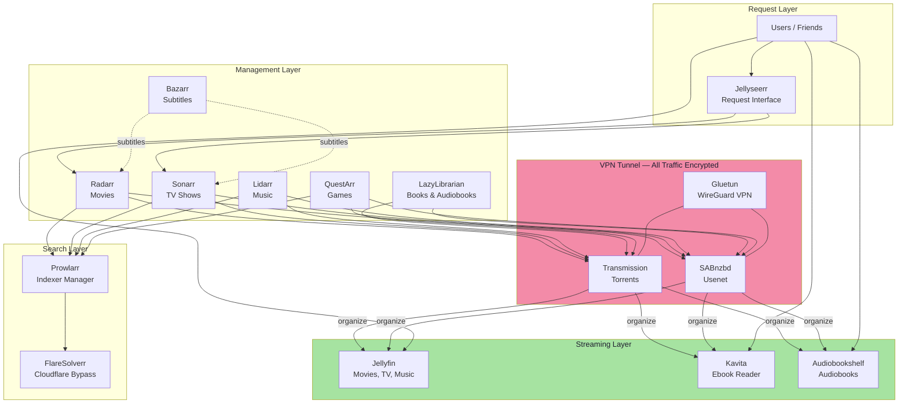
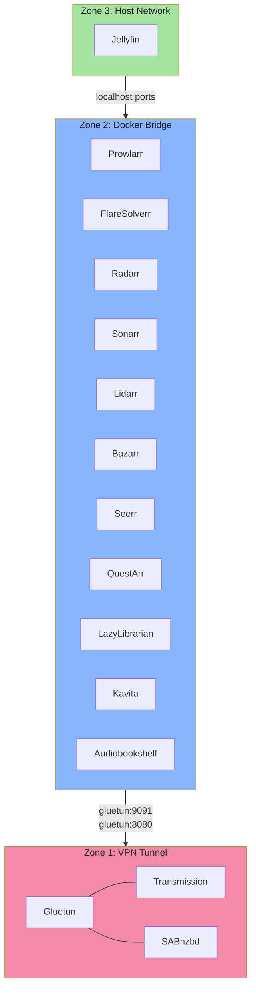
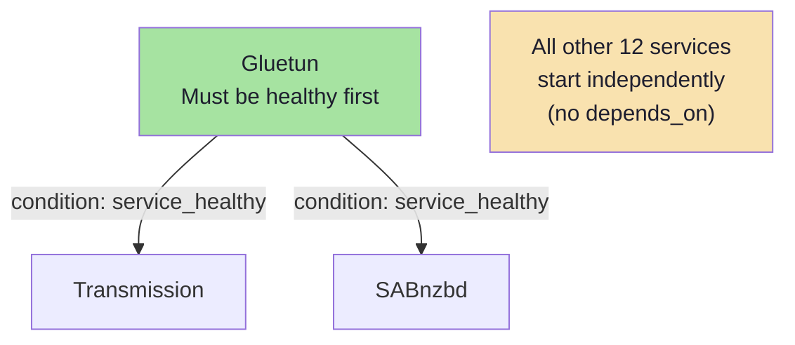
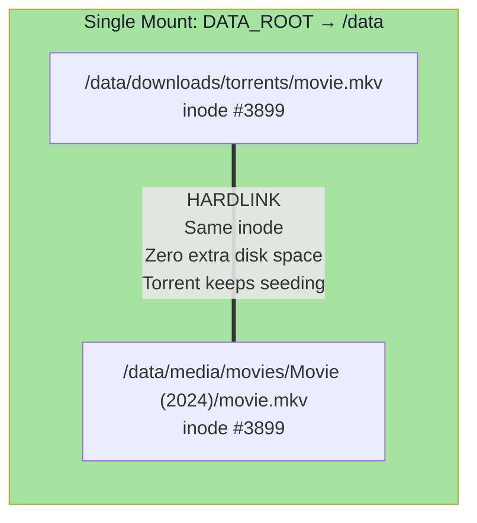
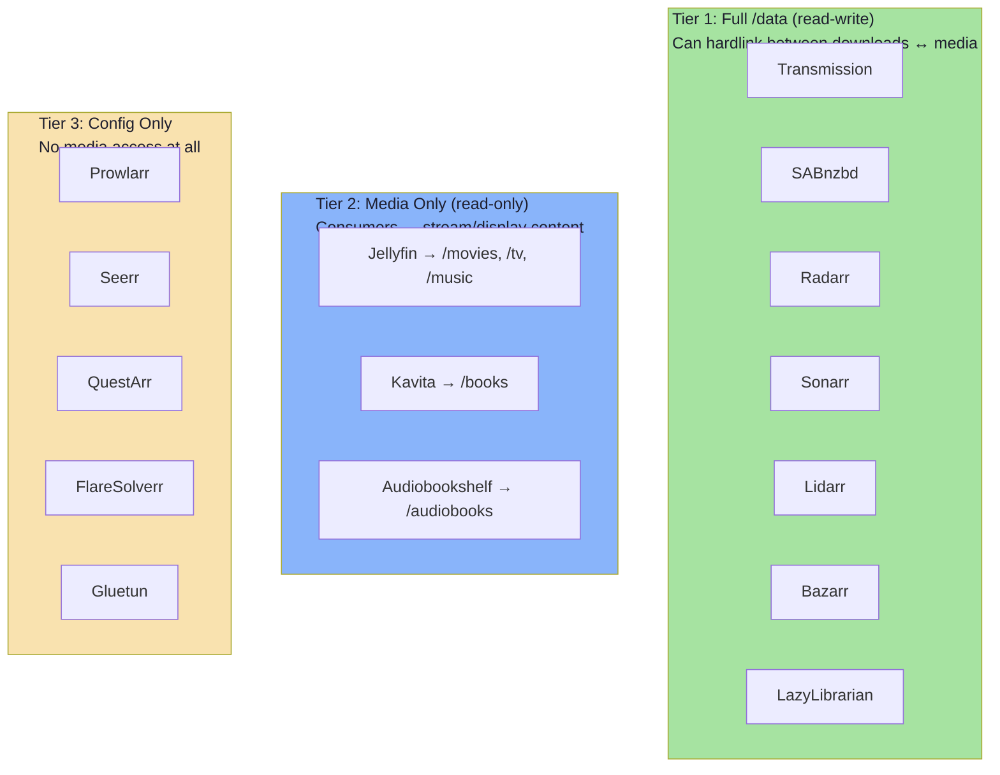

# arr-barr Architecture

A self-hosted, automated media server stack that searches, downloads, organizes, and streams movies, TV, music, books, audiobooks, and games — with full VPN protection on all download traffic.

## The Big Picture



## 15 Services at a Glance

| # | Service | Port | Role | Always On? |
|---|---------|------|------|:---:|
| 1 | **Gluetun** | — | WireGuard VPN tunnel with kill switch | Yes |
| 2 | **Transmission** | 9091 | Torrent download client (inside VPN) | Yes |
| 3 | **SABnzbd** | 8080 | Usenet download client (inside VPN) | Yes |
| 4 | **Prowlarr** | 9696 | Manages all indexers, syncs to arr apps | Yes |
| 5 | **FlareSolverr** | 8191 | Bypasses Cloudflare protection for indexers | Yes |
| 6 | **Radarr** | 7878 | Movie search, download, organize | Yes |
| 7 | **Sonarr** | 8989 | TV show search, download, organize | Yes |
| 8 | **Lidarr** | 8686 | Music search, download, organize | Yes |
| 9 | **Bazarr** | 6767 | Automatic subtitle downloads | Yes |
| 10 | **Jellyfin** | 8096 | Media server (self-hosted Netflix) | Yes |
| 11 | **Jellyseerr** | 5055 | User-friendly request interface | Yes |
| 12 | **QuestArr** | 5002 | Game search and download | Yes |
| 13 | **LazyLibrarian** | 5299 | Book & audiobook search/download | Optional |
| 14 | **Kavita** | 5004 | Browser-based ebook reader | Optional |
| 15 | **Audiobookshelf** | 13378 | Audiobook server with progress tracking | Optional |

## Three Network Zones



**Zone 1 — VPN Tunnel:** Transmission and SABnzbd share Gluetun's network namespace. They have no independent network access — all traffic exits through the encrypted WireGuard tunnel. If the VPN drops, the kill switch blocks everything.

**Zone 2 — Docker Bridge:** All management apps live on a private bridge network. They communicate by container name (e.g., `radarr:7878`). Search traffic goes directly to the internet (no VPN needed for searching).

**Zone 3 — Host Network:** Jellyfin runs directly on the host for maximum streaming performance and DLNA support.

## Dependency Chain



Only one hard dependency: download clients wait for the VPN to be healthy. Everything else starts in parallel and retries connections on its own.

## Optional Service Profiles

Books/audiobook services are profile-gated. Enabling any reader automatically enables LazyLibrarian (the acquisition engine).

| `COMPOSE_PROFILES=` | LazyLibrarian | Kavita | Audiobookshelf |
|---------------------|:---:|:---:|:---:|
| _(empty)_ | OFF | OFF | OFF |
| `kavita` | ON | ON | — |
| `audiobookshelf` | ON | — | ON |
| `kavita,audiobookshelf` | ON | ON | ON |

## Hardlink Architecture (TRaSH Guides)

The key to zero-waste storage: every service that touches both downloads and media mounts the **same root directory**. This keeps everything on one filesystem, enabling hardlinks.



**Why this matters:** A 50GB movie file doesn't get copied — it gets a second filename pointing to the same data blocks. The torrent client keeps seeding from the original path while Jellyfin streams from the library path. Zero duplication.

## Volume Mount Tiers



## Directory Tree

```
DATA_ROOT/
├── config/                    Service databases & settings (15 directories)
│   ├── radarr/               Movies DB, config
│   ├── sonarr/               TV DB, config
│   ├── lidarr/               Music DB, config
│   ├── bazarr/               Subtitle DB, config
│   ├── prowlarr/             Indexer DB
│   ├── transmission/         Torrent client settings
│   ├── sabnzbd/              Usenet client settings
│   ├── jellyfin/             Media server config
│   ├── jellyfin-cache/       Transcoding cache
│   ├── seerr/                Request DB (must be 1000:1000)
│   ├── lazylibrarian/        Book search config
│   ├── kavita/               Ebook reader config
│   ├── audiobookshelf/       Audiobook server config
│   ├── audiobookshelf-meta/  Audiobook metadata
│   └── questarr/             Game tracking DB
├── downloads/                 Staging area (temporary)
│   ├── incomplete/           In-progress downloads
│   ├── torrents/             Completed torrents (keep for seeding)
│   │   ├── radarr/          Movies
│   │   ├── tv-sonarr/       TV shows
│   │   ├── lidarr/          Music
│   │   ├── books/           Books & audiobooks
│   │   └── games/           Games
│   └── usenet/               Completed usenet (disposable staging)
│       ├── movies/
│       ├── tv/
│       ├── music/
│       ├── books/
│       ├── audiobooks/
│       └── games/
├── media/                     Organized final library
│   ├── movies/               → Jellyfin
│   ├── tv/                   → Jellyfin
│   ├── music/                → Jellyfin + Roon
│   ├── books/                → Kavita
│   ├── audiobooks/           → Audiobookshelf
│   └── games/                → GameVault
└── backups/                   Config backup archives
```
