# How It All Works

The complete journey from "I want to watch something" to "it's streaming on my TV."

## The Main Flow: Request → Search → Download → Organize → Stream

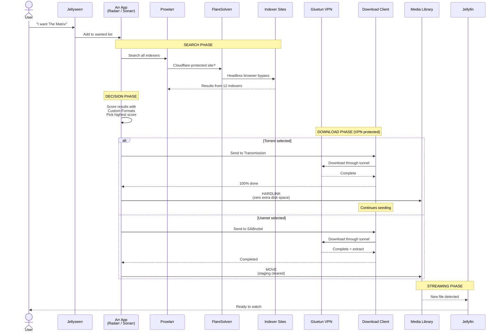

## VPN Kill Switch: What Happens When the Tunnel Drops

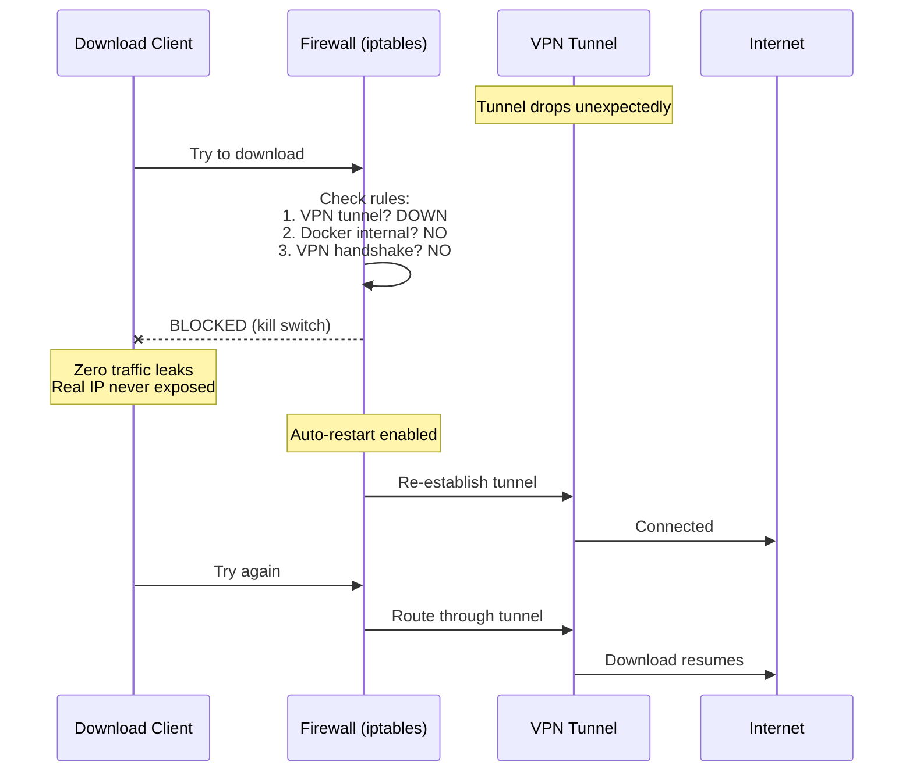

The kill switch uses iptables with a default DROP policy. Only three types of outbound traffic are allowed:
1. Traffic through the VPN tunnel interface
2. Docker-internal communication (container-to-container)
3. WireGuard handshake packets (to re-establish the tunnel)

Everything else is silently dropped. IPv6 is also fully blocked.

## Search Traffic vs Download Traffic

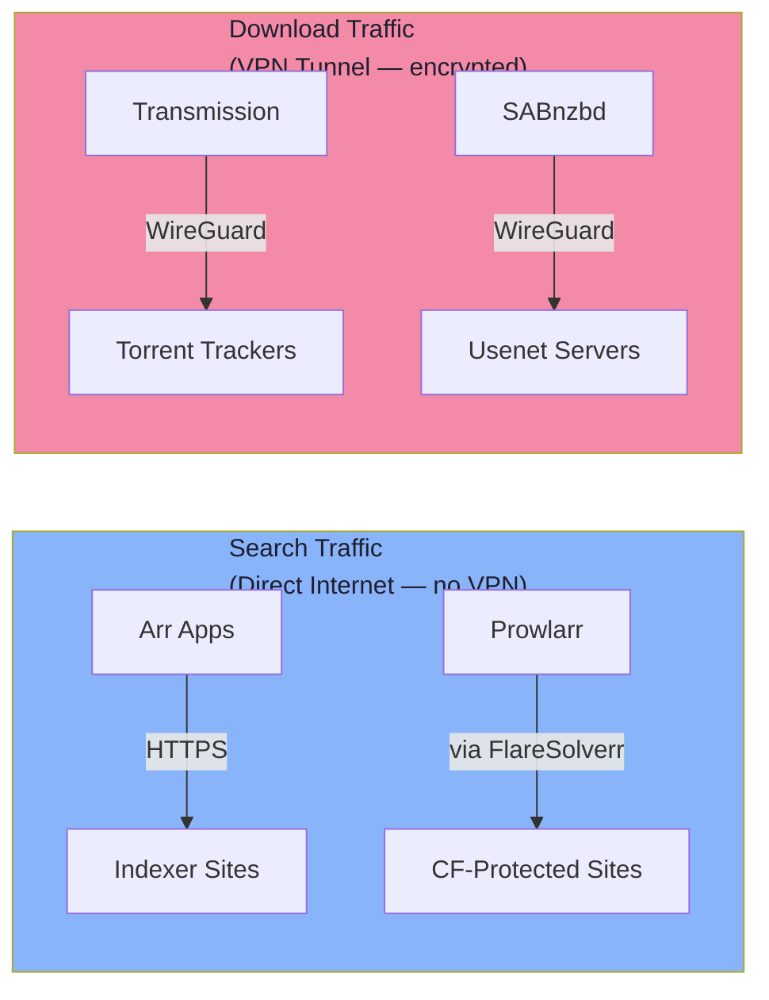

**Why searches don't need VPN:** Searching reveals what you're looking for, but downloading is what needs protection. Running searches through VPN would add latency and risk stability issues.

## Indexer Search Architecture

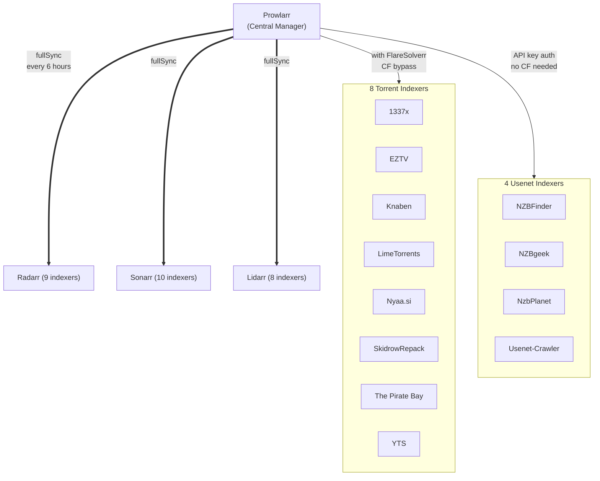

Prowlarr is the single source of truth for indexers. It pushes configs to each arr app via fullSync — add an indexer once in Prowlarr and it appears everywhere.

**Category filtering:** Each app only receives indexers relevant to its media type. EZTV (TV-only) syncs to Sonarr but not Radarr. YTS (movies-only) syncs to Radarr but not Sonarr.

## Download Category Routing

Each arr app tags downloads with a category that determines the landing directory:

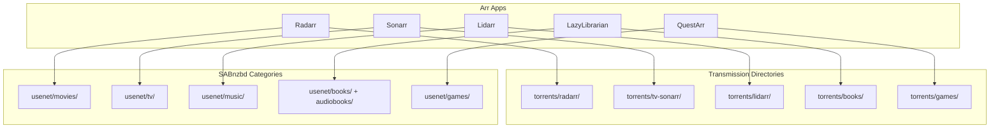

## Usenet Server Tiers

SABnzbd uses a multi-tier server architecture for maximum article completion:

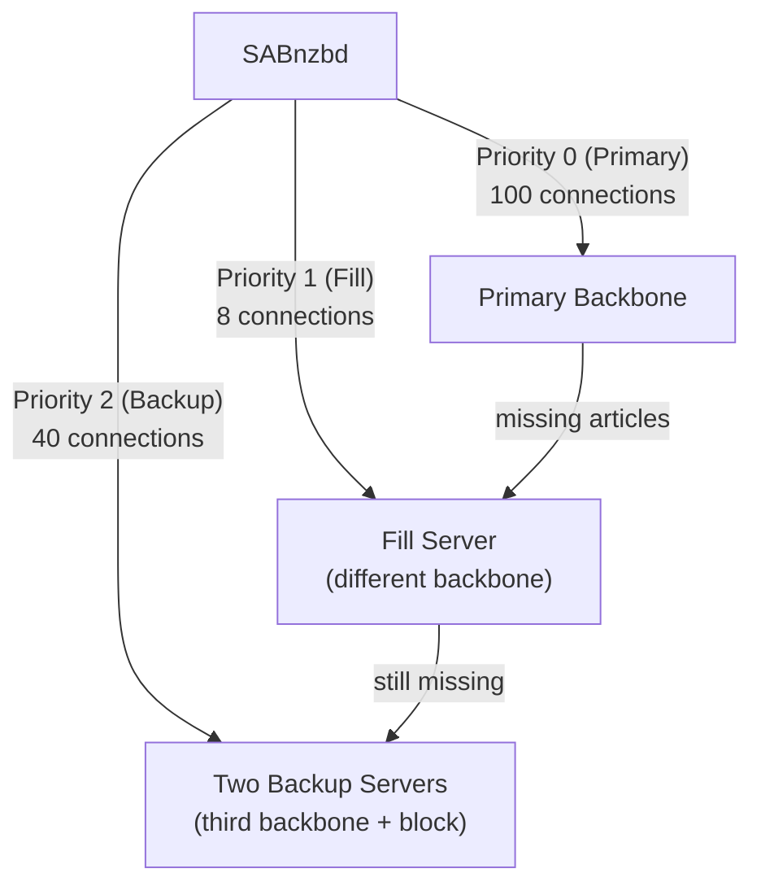

If the primary server is missing articles (DMCA takedowns), SABnzbd automatically tries the fill server, then backups. Different providers use different backbone networks, maximizing the chance of finding complete files.

## Torrent vs Usenet: Why Both?

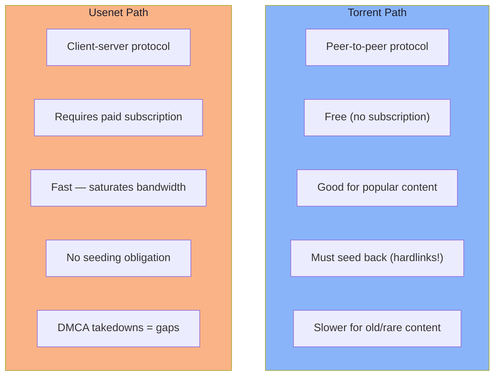

Having both maximizes availability. If a release is DMCA'd on usenet, torrents may still have it. If a torrent has few seeders, usenet may have it at full speed.

## The Hardlink Flow (Why Disk Space Doesn't Double)

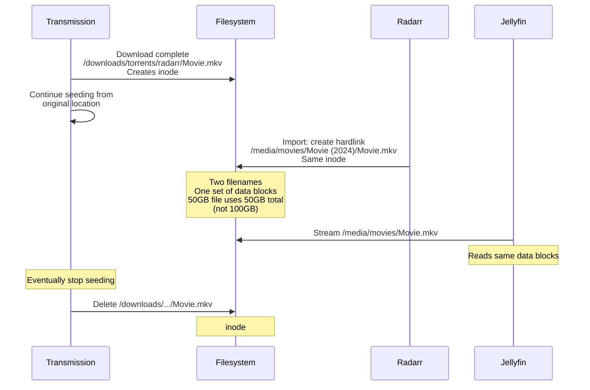

**The common mistake (and why it fails):**

```
WRONG: Two separate volume mounts
  -v /downloads:/downloads    ← mount 1
  -v /media:/media            ← mount 2
  Result: Cross-device hardlink fails → Radarr COPIES the file → disk doubles

RIGHT: Single volume mount
  -v /data:/data
  Both /data/downloads/ and /data/media/ on same mount
  Result: Hardlink works → zero extra space
```

## DNS Architecture

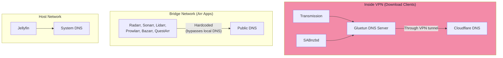

Arr apps use hardcoded public DNS to prevent local ad-blockers from interfering with indexer domain resolution. Download client DNS goes through the VPN tunnel for privacy.

## Game Pipeline (Special Case)

Games don't have a built-in import engine like movies/TV. A separate script bridges the gap:

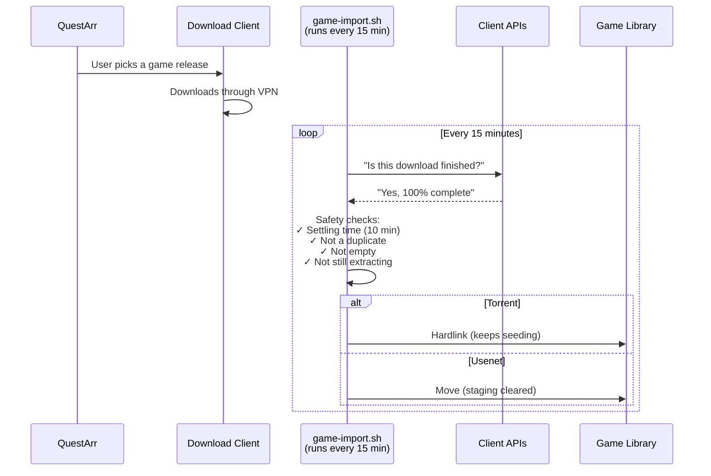

## Book Sorting (LazyLibrarian PostProcessor)

LazyLibrarian handles both ebooks and audiobooks through file-type detection:

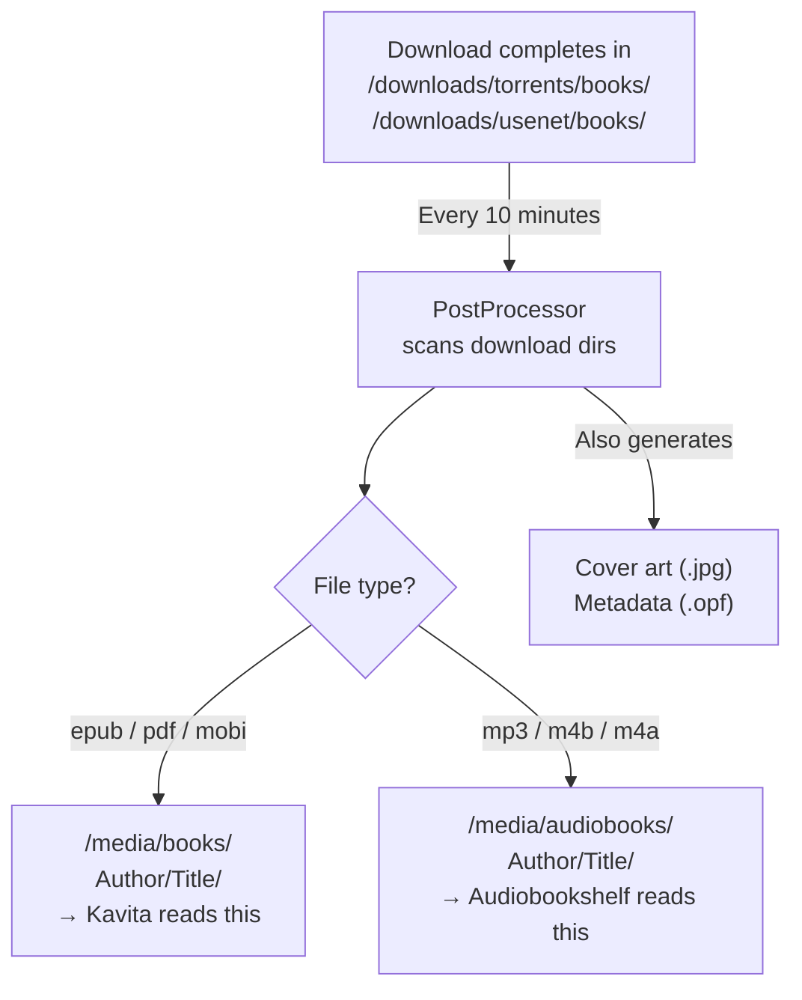

## Subtitle Flow

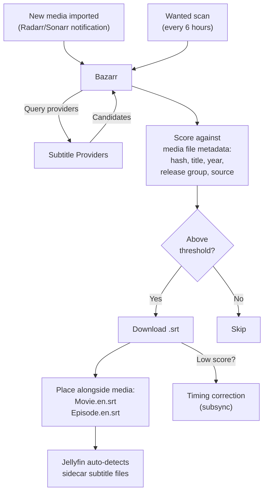
