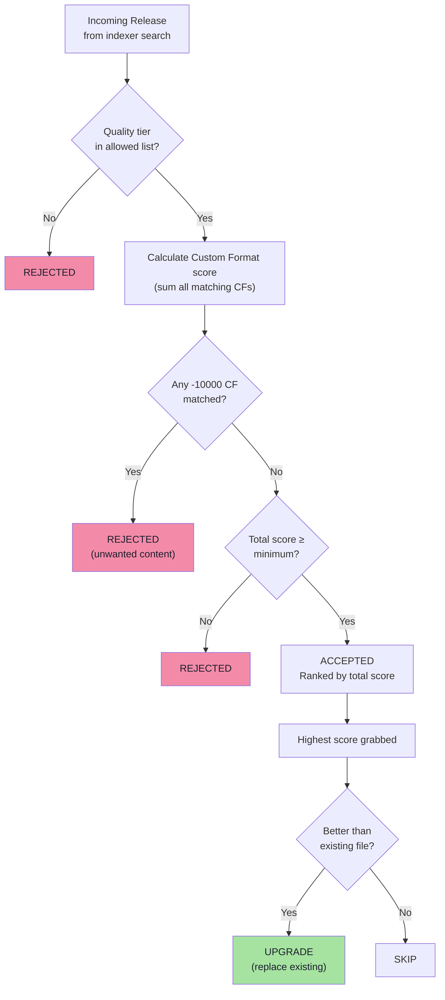
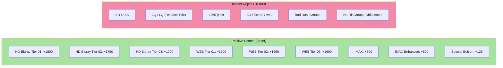
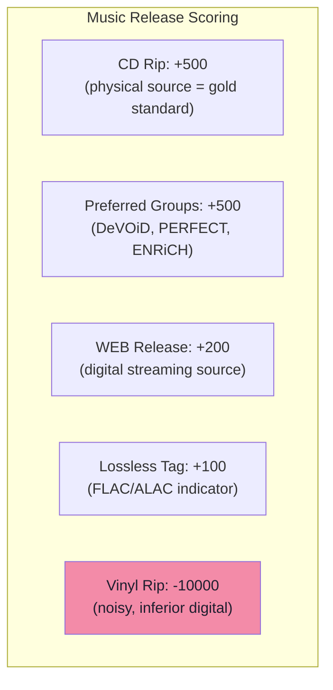
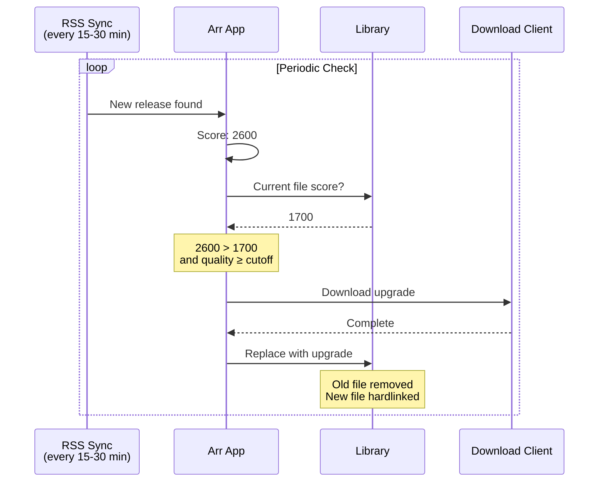
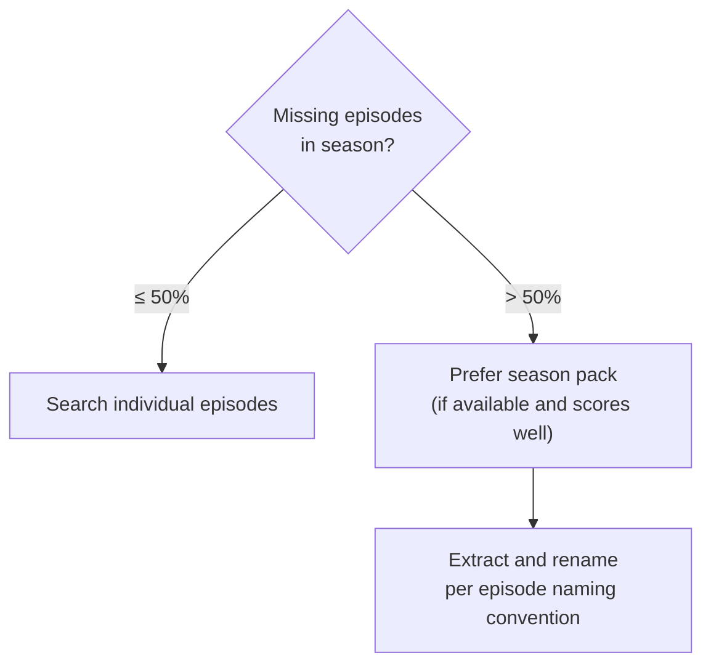

# Quality Profiles & Release Selection

How the stack decides which release to download when multiple options exist.

## The Decision Engine

Every arr app uses the same core algorithm:



## Custom Format Scoring Across All Apps

### Radarr — Movies (48 Custom Formats)



**Tier system:** Release groups are ranked into tiers based on their track record. A Tier 01 Bluray rip from DON scores +1800 while a random group with no history gets +0.

**Movie versions:** IMAX gets a massive +800 boost because IMAX versions have expanded aspect ratios and better sound. Special Editions, Remasters, Criterion, and Vinegar Syndrome releases get smaller boosts.

**14 streaming service CFs** (AMZN, NF, DSNP, etc.) score 0 in Radarr — they're used for tagging/naming only, not for selection.

### Sonarr — TV Shows (44 Custom Formats)

Key differences from Radarr:

| Feature | Radarr | Sonarr |
|---------|--------|--------|
| Streaming services | Score 0 (tagging only) | **+75 each** (17 services) |
| HDR/DV | Not scored | DV Boost +1000, HDR +500, HDR10+ +100 |
| SDR at 4K | Not penalized | **-10000** (want HDR for 4K content) |

**Why streaming services matter more for TV:** A Netflix or Disney+ WEB-DL of a TV show is almost certainly high quality. For movies, the release group matters more than the source.

### Lidarr — Music (5 Custom Formats, Davo's Guide)



**Min CF score: 1** — Lidarr requires at least one positive CF match. A random MP3 with no quality indicators scores 0 and gets skipped. This prevents grabbing garbage.

## Scoring Examples

### Movie: The Matrix

```
Release A: The.Matrix.1999.Bluray.1080p.x264-DON
  ✓ HD Bluray Tier 01 (+1800)
  = Score: 1800

Release B: The.Matrix.1999.IMAX.Bluray.1080p.x264-DON
  ✓ HD Bluray Tier 01 (+1800)
  ✓ IMAX (+800)
  = Score: 2600  ← WINNER

Release C: The.Matrix.1999.1080p.WEB-DL.AMZN-NTb
  ✓ WEB Tier 01 (+1700)
  ✓ AMZN (+0, tagging only)
  = Score: 1700

Release D: The.Matrix.1999.CAM.LQ-BadGroup
  ✗ LQ (-10000)
  = REJECTED
```

### TV Show: Premium 4K

```
Release A: Show.S01E01.2160p.DSNP.WEB-DL.DV.HDR.Atmos-FLUX
  ✓ WEB Tier 01 (+1700)
  ✓ Disney+ (+75)
  ✓ DV Boost (+1000)
  ✓ HDR (+500)
  ✓ UHD Streaming Boost (+75)
  = Score: 3350  ← WINNER

Release B: Show.S01E01.1080p.NF.WEB-DL-GROUP
  ✓ WEB Tier 02 (+1650)
  ✓ Netflix (+75)
  = Score: 1725

Release C: Show.S01E01.2160p.WEB-DL.SDR-BadGroup
  ✗ SDR at 4K (-10000)
  = REJECTED (want HDR for 4K)
```

### Music: FLAC Album

```
Release A: Album - FLAC - CD - DeVOiD
  ✓ CD (+500) + Preferred Groups (+500) + Lossless (+100)
  = Score: 1100  ← WINNER

Release B: Album - FLAC - WEB
  ✓ WEB (+200) + Lossless (+100)
  = Score: 300

Release C: Album - MP3-320
  No CF matches = Score: 0
  Below minimum (1) → SKIPPED

Release D: Album - Vinyl
  ✗ Vinyl (-10000) → REJECTED
```

## Quality Profile Settings

| Setting | Radarr | Sonarr | Lidarr |
|---------|--------|--------|--------|
| Profile name | "Any" | "Any" | "Any" |
| Upgrade allowed | Yes | Yes | Yes |
| Cutoff quality | Bluray-1080p | WEB 2160p | Lossless |
| Min CF score | 0 | 0 | 1 |
| Cutoff CF score | 10000 | 10000 | 10000 |
| Propers/Repacks | CF-handled (+5/+6/+7) | CF-handled | Do Not Prefer |

**Cutoff CF score of 10000** means the app essentially never stops looking for upgrades. A Tier 01 Bluray IMAX (2600) will still be upgraded if a Tier 01 Bluray IMAX Criterion (2625) appears.

## Upgrade Flow



## Season Pack Logic (Sonarr)

When more than 50% of a season's episodes are missing, Sonarr prefers downloading the entire season pack over individual episodes. Season packs are evaluated against the same CF scoring system.



## Naming Conventions (TRaSH Guide)

**Movies:**
```
Movie Name (2024) {Edition Tags} [Custom Formats][Bluray-1080p][DTS-HD MA 7.1][HDR10][x265]-ReleaseGroup
```

**TV Episodes:**
```
Series Name (2024) - S01E01 - Episode Title [WEB Tier 01 WEB-DL-1080p][EAC3 5.1][x264]-ReleaseGroup
```

**Anime:**
```
Anime Name (2024) - S01E01 - 001 - Episode Title [CFs Quality][Audio Languages][HDR][x265 10bit]-Group
```

**Music Tracks:**
```
Album Title (2024)/01 - Track Title.flac
```

**Artist Folders:** `{Artist NameThe}` — "Beatles, The" sorts under B.
