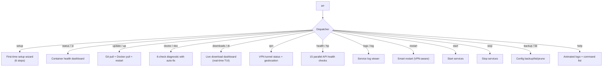
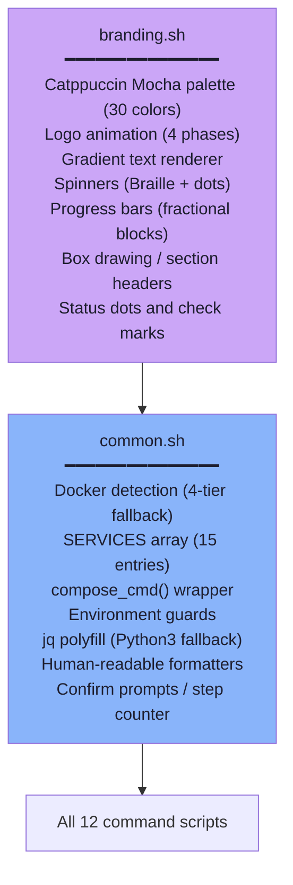
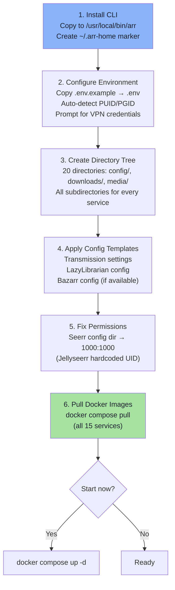
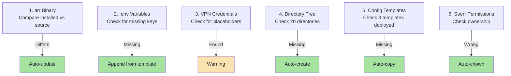
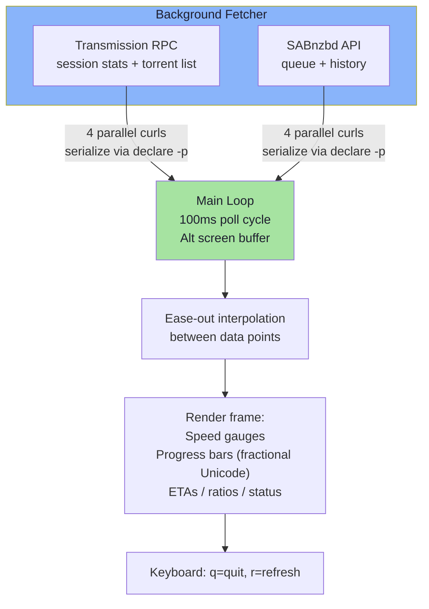
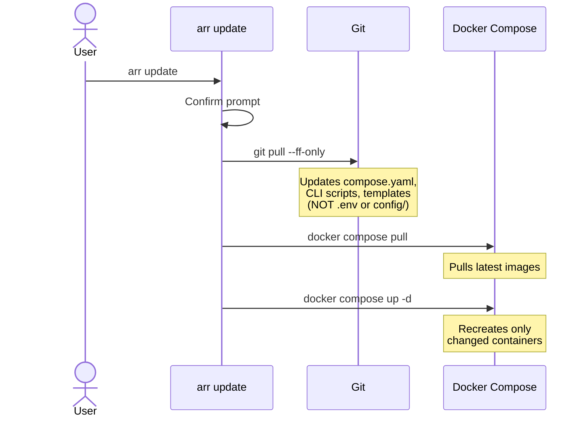
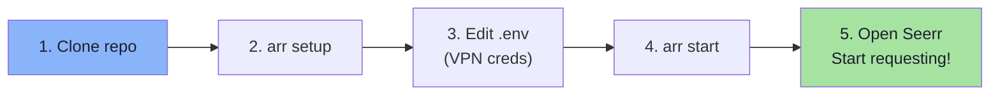
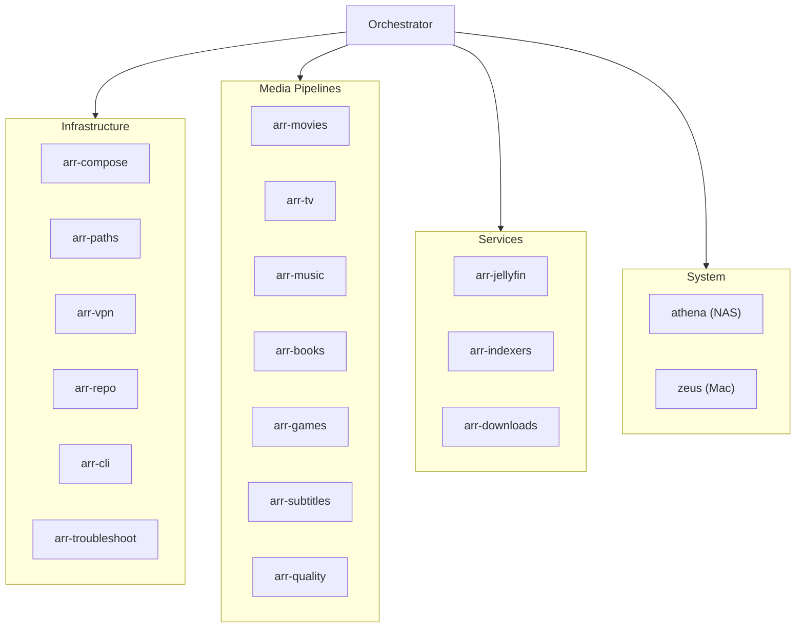

# Operations & CLI

## The `arr` CLI

A custom command-line interface with 12 commands, Catppuccin Mocha theming, animated ASCII logos, and real-time dashboards.

### Command Map

### Quick Reference

| Command | What It Does |
|---------|-------------|
| `arr setup` | Full first-time initialization (install, env, dirs, templates, pull images) |
| `arr status` | Show all containers with up/down status, profiles, troubleshooting hints |
| `arr update` | Pull latest code + Docker images, restart changed containers |
| `arr doctor` | Diagnose and auto-fix: binary, env vars, VPN creds, dirs, templates, perms |
| `arr downloads` | Live TUI dashboard with Transmission + SABnzbd progress bars and speeds |
| `arr downloads --once` | Single snapshot (no live refresh) |
| `arr vpn` | Check VPN tunnel, show public IP and geolocation |
| `arr health` | Hit all 15 service endpoints in parallel, show response times |
| `arr logs sonarr` | Last 100 lines of a service's logs |
| `arr logs sonarr -f` | Follow logs live |
| `arr restart vpn` | Restart Gluetun → wait 10s → restart download clients |
| `arr restart downloads` | Restart Transmission + SABnzbd |
| `arr backup` | Create timestamped tar.gz of all service configs |
| `arr backup --list` | List existing backups with sizes |
| `arr backup --prune 5` | Keep only 5 most recent backups |

### Script Architecture

Every script sources `common.sh` (which chains to `branding.sh`), giving all commands consistent theming and utilities. All scripts use `set -euo pipefail`.

## Setup Flow

**Idempotent:** If already set up, exits immediately.

## Doctor Self-Repair

## Downloads Dashboard

The most complex CLI component — a real-time terminal UI:

**Display limits:** 5 downloading torrents, 5 seeding, 5 SABnzbd active, 3 queued, 3 history.

## Health Check Endpoints

All 15 services are checked in parallel with 2-second timeouts:

| Service | Endpoint | Expected |
|---------|----------|----------|
| Gluetun | /v1/openvpn/status | 302 |
| Transmission | /transmission/rpc | 409 |
| SABnzbd | /api?mode=version | 200 |
| Prowlarr | /ping | 200 |
| FlareSolverr | /health | 200 |
| Radarr | /ping | 200 |
| Sonarr | /ping | 200 |
| Lidarr | /ping | 200 |
| Bazarr | /ping | 200 |
| Jellyfin | /System/Info/Public | 200 |
| Seerr | /api/v1/status | 200 |
| LazyLibrarian | /api?cmd=getVersion | 200 |
| Kavita | /api/health | 200 |
| Audiobookshelf | /healthcheck | 200 |
| QuestArr | / | 200 |

Color-coded: green (healthy), yellow (>1000ms), red (wrong code or timeout).

## Update Pipeline

### What Gets Updated

| Component | Updated? | How |
|-----------|:---:|-----|
| compose.yaml | Yes | git pull |
| CLI scripts | Yes | git pull |
| Templates | Yes | git pull (NOT auto-deployed) |
| .env | No | gitignored, personal |
| Service configs/DBs | No | gitignored, runtime |
| Docker images | Yes | docker compose pull |
| /usr/local/bin/arr | No | Only via `arr doctor` |

## Onboarding (Friends)

Friends update with `arr update` — pulls latest code and Docker images in one command.

## Agent Ecosystem

The stack is managed by 16+ specialized Claude Code agents:

Each agent has:
- **Domain expertise** — deep knowledge of its specific area
- **Tool access** — Bash, Read, Write, Edit, Glob, Grep (some have WebFetch)
- **NAS access** — SSH to Athena for live verification
- **Autonomous operation** — given a task, investigates and fixes independently
- **Parallel execution** — multiple agents can run simultaneously

Agents communicate through the orchestrator (not directly with each other) and update persistent memory files for cross-conversation continuity.

## Branding

- **Theme:** Catppuccin Mocha (24-bit true color throughout)
- **Logo:** Pandai Technologies ASCII art with 4-phase rainbow animation
- **Progress bars:** Fractional Unicode blocks (▏▎▍▌▋▊▉█) for smooth percentages
- **Spinners:** Braille animation (⠋⠙⠹⠸⠼⠴⠦⠧⠇⠏) at 80ms intervals
- **Gradients:** Per-character RGB interpolation via awk
- **Tab completion:** Bash completion for all commands, services, and flags
